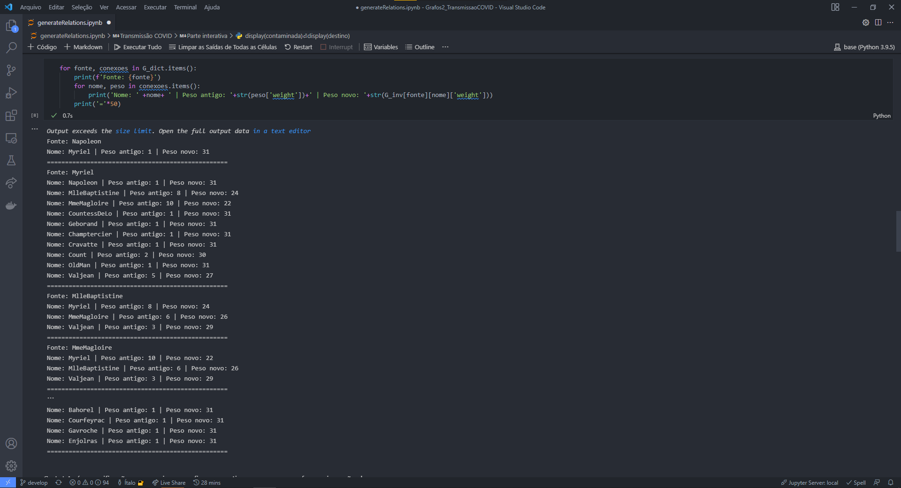
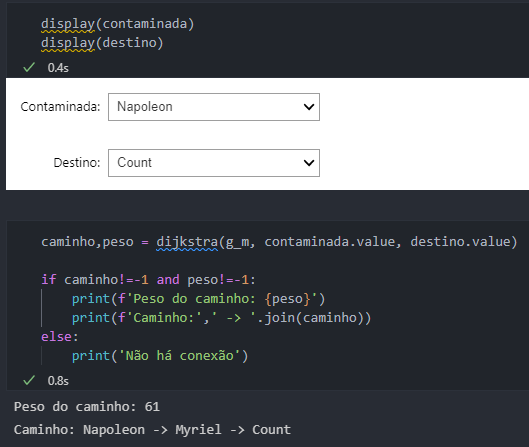

# Transmissao COVID

**Número da Lista**: 2<br>
**Conteúdo da Disciplina**: Grafos2<br>

## Alunos
|Matrícula | Aluno |
| -- | -- |
| 18/0102656  |  Ítalo Vinícius |
| 18/0145088  |  Gabriel Bonifácio |

## Sobre 

<div align="center">

  
  
</div>

O objetivo deste projeto é identificar o peso das relações pessoais em um grafo, verificando a partir de uma pessoa com COVID e uma pessoa sem COVID como seria a trasmissão mais propicia entre estas pessoas. Utilizamos um dataset de personagens do musical 'Les Miserables' para podermos fazer essas comparações.

## Screenshots

<div align="center">

  

  [Figura 1: Imagem do programa](./images/1.png)

</div>
  
<div align="center">

  
  
  [Figura 2: Imagem do programa](./images/2.png)
  
 </div>
  
<div align="center">

  
  
  [Figura 3: Imagem do programa](./images/3.png)
  
</div>


## Instalação 
**Linguagem**: Python<br>
**Framework**: Jupyter<br>

Siga as instruções a seguir para rodar o programa:

1) Fazer a instalação do Python, em uma versão superior a 3.6

2) Instalar as seguintes bibliotecas

```sh 
pip install jupyter-lab
pip install networkx
pip install matplotlib
pip install ipywidgets
```

3) Clonar o repositório.

```sh 
git clone https://github.com/projeto-de-algoritmos/Grafos2_TransmissaoCOVID.git
```

4) Acessar a pasta da aplicação 

```sh 
cd Grafos2_TransmissaoCOVID/
```

5) Executar o seguinte comando dentro da pasta clonada

```sh 
jupyter-lab
```

6) Acessar o arquivo 

```sh 
main.ipynb
```

7) Executar todas as células e visualizar os resultados.

8) Pronto. Agora, você poderá escolher um personagem contaminada e um personagem de destino. Divirta-se!

## Uso 
A partir do menu de interação abaixo, escolha um personagem de origem e destino e você poderá visualizar o caminho mais propício para a transmissão.

<div align="center">

  
  
  [Figura 4: Imagem do programa](./images/img1_vscode.png)
  
 </div>

## Outros 
As informações de conexões foram extraídas dos livros, baseado nessa [biblioteca](https://networkx.org/documentation/stable/reference/generated/networkx.generators.social.les_miserables_graph.html).